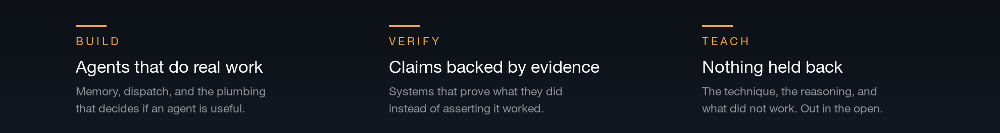

**[Approach](#the-approach)&nbsp;·&nbsp;[Running Agents](#how-i-run-agents)&nbsp;·&nbsp;[Offensive Security](#offensive-security)&nbsp;·&nbsp;[Building](#what-im-building)&nbsp;·&nbsp;[Rules](#field-rules)&nbsp;·&nbsp;[Stack](#what-i-reach-for)&nbsp;·&nbsp;[Writing](#writing)&nbsp;·&nbsp;[Connect](#connect)**

 

I am an agentic engineer and an offensive security practitioner. I build AI agents that do real work unattended, and I red team agentic systems so the ones I ship still hold when someone hostile shows up.

Everything I build points at one thing: **putting real capability in the hands of individuals instead of institutions.** The tools that decide who gets leverage are being written right now, and most people are handed the consumer version. I would rather hand them the actual thing, with the reasoning attached, so they can run it themselves and change it when it stops fitting.

For more than a year I have run my own work through a personal AI operating system every single day: a fleet of agents with durable memory, verification gates, cost-aware model routing, and a voice. This account is where the parts worth keeping get published.

 

 

## The Approach

**Build.** Agents are easy to demo and hard to operate. The work that matters is the layer nobody screenshots: memory that survives a restart, dispatch that picks the right model instead of the most expensive one, and failure handling that surfaces problems instead of swallowing them.

**Verify.** An agent saying it worked is not evidence that it worked. I build systems that produce proof, I attack them the way an adversary would, and I hold my own claims to the same standard. "It should work" is not a result.

**Teach.** The reasoning travels with the code. What I tried, what broke, and why the second approach was better. A tool you cannot reason about is a tool you cannot fix, and a field this new needs more people who can reason about it.

 

## How I Run Agents

Success is about ten percent model and ninety percent harness. The model is the easy part to buy. The harness is the part you have to build, and it is where every unattended agent either earns trust or quietly loses it.

<table>
<tr>
<td valign="top" width="50%">

**Two tiers, deliberately inverted** 
The frontier model designs the loop once: the prompts, the tool boundaries, the exit condition, the verification gates. Cheaper and local models then run that loop a thousand times. When a cheap model fails, the first question is what is wrong with the harness, not which bigger model to escalate to.

</td>
<td valign="top" width="50%">

**Memory that survives a restart** 
Files as memory, a typed knowledge graph over the notes, and receipts for every recall so an agent can show what it knew and where it learned it. Context an agent cannot recover after a crash was never really memory.

</td>
</tr>
<tr>
<td valign="top" width="50%">

**Verification gates instead of trust** 
"Done" is a claim, and every claim gets a probe with a matching kind of evidence: a file gets read, an endpoint gets curled, a UI gets viewed in a real browser, motion gets frame scrubbed. A probe does not count until it has been seen to fail on a wrong artifact.

</td>
<td valign="top" width="50%">

**Cost control as a feature** 
Model and effort are chosen per unit of work, by rung, with burn reports and quota-aware dispatch. The expensive model is spent on shape and judgment. The agent fleet is never allowed to top its own cost report.

</td>
</tr>
<tr>
<td valign="top" width="50%">

**A fleet, not a chat window** 
Many agents in named terminal tabs, each with a brief, a loop, and an exit condition. My job is orchestration: brief, monitor, verify, correct, re-prompt, close. When an agent is finished it is closed and proven closed. Idle agents are leaks.

</td>
<td valign="top" width="50%">

**Self-improving by contract** 
Errors are the input, not the interruption. A lesson that only lives as prose will repeat, so every lesson becomes a check, a gate, or a test that makes the mistake unshippable. Self-modification happens on a branch behind a pull request, because the PR is the rollback.

</td>
</tr>
</table>

 

## Offensive Security

Agentic systems have an attack surface nobody has fully drawn yet. Tool calls, MCP servers, retrieved documents, agent-to-agent messages, and the memory an agent trusts are all inputs, and every input is a place an adversary can stand. I work that surface from both sides, under the **[Krypteia Sec](https://krypteiasec.com)** name.

Both frontier labs have vetted me for dual-use cyber work. The safeguards that block offensive security tooling by default are lifted on my accounts, on the strength of the work I described and the rules I keep.

&nbsp;

<table>
<tr>
<td valign="top" width="50%">

**Red teaming AI agents** 
Direct and indirect prompt injection, retrieval poisoning, tool boundary abuse, excessive agency, and the trust agents extend to each other. Findings come with a reproduction or they do not count.

</td>
<td valign="top" width="50%">

**MCP and agent tooling audits** 
Model Context Protocol servers are the new supply chain. I build agents that enumerate, exercise, and audit them, with receipts for every claim, against a control so the result is a finding and not a feeling.

</td>
</tr>
<tr>
<td valign="top" width="50%">

**Hackbots with receipts** 
Autonomous agents for reconnaissance and assessment where every step is logged, every finding reproduces, and nothing runs outside an owned range or written authorization.

</td>
<td valign="top" width="50%">

**Threat intelligence, researched live** 
A daily AI and cyber intelligence brief built from primary sources, an intelligence graph so nothing repeats, and short operator takes on the items that change how you should defend this week.

</td>
</tr>
</table>

 

## What I'm Building

**[AI Engineer Certification](https://github.com/jasonjeske/ai-engineer-certification)**   
A free certification from zero to hireable: 19 courses, 151 chapters, a runnable lab and a notebook for every chapter, and a language model you build by hand. No paywall, no login. The interactive version lives at <a href="https://krypteiasec.com/academy">krypteiasec.com/academy</a>; this repository is everything you clone, read, and run yourself.

**[AI Cost Efficiency](https://github.com/jasonjeske/ai-cost-efficiency)**   
Standards, templates, runnable tools, and a measurement method for controlling what coding agents actually cost. Built on the mechanic most teams never price in: the model re-reads the entire conversation on every turn, so session cost grows roughly quadratically with turn count. Vendor-neutral, zero dependencies, no prices quoted because prices go stale and mechanics do not.

**[Claude Code Work Setup](https://github.com/jasonjeske/vscode-claude-code)**   
A safe starter for a first-time Claude Code user inside a large enterprise, built for confidential, evidence-heavy work. It asks before every change, keeps everything local, and tracks each platform claim as verified or not, because a setup guide that guesses is a liability.

More is landing here. The areas below are where the work is going.

<table>
<tr>
<td valign="top" width="50%">

**Agent operating system** 
The kernel underneath the fleet: memory, dispatch, cost control, verification, and a self-improvement loop, for agents that run unattended and have to be trusted with real work.

</td>
<td valign="top" width="50%">

**Agent and MCP security tooling** 
Auditors, injection harnesses, and red team playbooks for agentic systems, with reproduction built in.

</td>
</tr>
<tr>
<td valign="top" width="50%">

**Local-first pipelines** 
Media, voice, and content workflows that run on your own hardware at zero marginal cost.

</td>
<td valign="top" width="50%">

**Field notes** 
Write-ups on what held up under load and what quietly broke, with the reasoning behind the calls.

</td>
</tr>
</table>
 

## Field Rules

A short list of rules that each cost me something to learn.

<table>
<tr><td width="34" align="center"><b>1</b></td><td><b>Verify, then claim.</b> Run the thing and read the output. An exit code is not a result, and a green check is not proof.</td></tr>
<tr><td align="center"><b>2</b></td><td><b>The target matters more than the technique.</b> Building the wrong thing beautifully is still building the wrong thing. Read the target back out loud before you start.</td></tr>
<tr><td align="center"><b>3</b></td><td><b>A probe is not evidence until you have watched it fail.</b> Run every check once against something that should pass and once against something that should not. A gate that cannot fail is decoration.</td></tr>
<tr><td align="center"><b>4</b></td><td><b>A workaround outlives its cause.</b> When the machine, the transport, or the constraint changes, re-derive the design instead of porting the compromise.</td></tr>
<tr><td align="center"><b>5</b></td><td><b>Shortcuts are fine when they are labeled.</b> An undocumented shortcut is a bug with a delay on it. Write down the ceiling and what triggers the upgrade.</td></tr>
<tr><td align="center"><b>6</b></td><td><b>Ship the boring version first.</b> You find out what is actually missing once something real is running, never before.</td></tr>
<tr><td align="center"><b>7</b></td><td><b>Look at the thing.</b> Most of my worst calls came from reasoning about output I never actually opened. Judge it at the size the reader will see it.</td></tr>
<tr><td align="center"><b>8</b></td><td><b>A lesson that only lives as prose will repeat.</b> Turn it into a check that fails, or accept that you will learn it again.</td></tr>
<tr><td align="center"><b>9</b></td><td><b>Every input is an attack surface.</b> Tool results, retrieved documents, and other agents are untrusted until proven otherwise. Build like the adversary is already in the context window.</td></tr>
</table>

 

## What I Reach For

<table>
<tr>
<td align="right" valign="top"><b>Agents</b></td>
<td>
&nbsp;&nbsp;&nbsp;&nbsp;&nbsp;&nbsp;
</td>
</tr>
<tr>
<td align="right" valign="top"><b>Build</b></td>
<td>
&nbsp;&nbsp;&nbsp;&nbsp;
</td>
</tr>
<tr>
<td align="right" valign="top"><b>Run</b></td>
<td>
&nbsp;&nbsp;&nbsp;&nbsp;
</td>
</tr>
</table>

 

## Writing

Three running series, published under my own name on **[LinkedIn](https://www.linkedin.com/in/jjeske)**:

<table>
<tr><td valign="top"><b>AI &amp; Cyber Intelligence</b></td><td>The daily brief. What moved in AI and in cyber, researched live from primary sources, with the builder's read and the defender's read side by side.</td></tr>
<tr><td valign="top"><b>Agentic AI Red Team</b></td><td>A numbered series on attacking and defending agentic systems: injection, tool abuse, MCP, memory, and the trust between agents.</td></tr>
<tr><td valign="top"><b>AI Threat Pulse</b></td><td>Short operator takes on one current item and what it changes for the people running agents this week.</td></tr>
</table>

The long-form teaching lives in the free <a href="https://krypteiasec.com/academy">AI Engineer Certification</a>.

 

## Connect

[Krypteia Sec](https://krypteiasec.com)&nbsp;·&nbsp;[LinkedIn](https://www.linkedin.com/in/jjeske)&nbsp;·&nbsp;[Buy Me a Coffee](https://buymeacoffee.com/jasonjeske)&nbsp;·&nbsp;[All Repos](https://github.com/jasonjeske?tab=repositories)

 

 

If something here saved you time, a coffee is a nice way to say so. Everything stays free either way.

 

Everything here is my own work, published under my own name. Security work runs only against systems I own or hold written authorization for.

