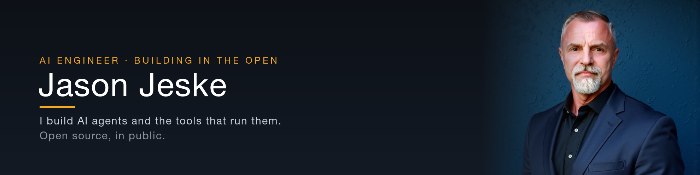

## Hey, I'm Jason

I build AI agents and the infrastructure they run on.

Most of what lives here started as something I needed for my own work. I got tired of rebuilding the same primitives, so I made them properly, used them daily, and put them out where other people could use them too. That's the whole filter for this account: if it earned its place in my own workflow, it's worth publishing.

I'm not interested in demos that fall over the moment you point real work at them. Everything here has been run in anger.

## What I build

**Agent tooling.** The unglamorous layer that decides whether an agent is useful or just impressive in a screenshot. Memory that survives a restart, verification that actually verifies, dispatch that routes work to the right model instead of the most expensive one.

**Small sharp utilities.** Single-purpose things that do one job completely. The kind of tool you install once and stop thinking about.

**Notes from the work.** What held up under load, what quietly broke, and the reasoning behind the calls. Written the way I'd want to read it: no hand-waving, no pretending the first attempt worked.

## What I'm working on

- Making agents verify their own claims instead of asserting them
- Local-first pipelines that cost nothing per run
- Turning a year of daily practice into something teachable

## What I reach for

## How I work

I keep a short list of rules that have cost me something to learn:

1. **Verify, then claim.** "It should work" is not a result. Run the thing and read the output.
2. **The target matters more than the technique.** Building the wrong thing beautifully is still building the wrong thing.
3. **Shortcuts are fine when they're labeled.** An undocumented shortcut is just a bug with a delay on it.
4. **Ship the boring version first.** You can tell what's actually missing once something real is running.

## Say hello

Open an issue, start a discussion, or just fork something and make it better. If you're building in this space I'd genuinely like to hear what you're working on.

Everything here is my own work, published under my own name.
